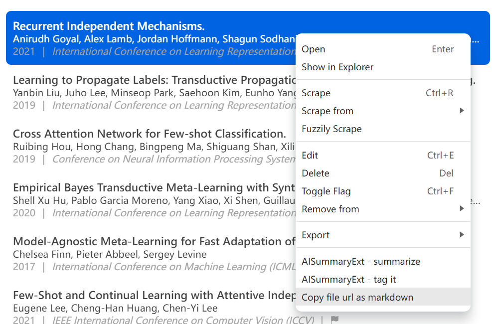

# Paperlib Extension - Copy file url as markdown

This is an extension for [paperlib](https://github.com/Future-Scholars/paperlib).

**Copy paper's local file url as markdown.** 

The markdown link opens the pdf file with system default pdf viewer.

## Usage

Right click on a paper, click `copy file url as markdown`



## URL Format

By default, you will get the url started with the file url protocol `file://...`, which is an absolute path on your device.

```markdown
[papername](file:///C:/Users/me/Documents/paperlib/filename.pdf) 
```

If [apihost extension](https://github.com/Future-Scholars/paperlib-apihost-extension) enabled, you can switch on "Use APIHost format" in extension preference, which sets link to http protocol that is a relative path based on your current paperlib storage folder.

```markdown
[papername](http://127.0.0.1:21227/PLAPI.fileService.open/?args=["file://filename.pdf"])
```

Both links open the pdf file with system default pdf viewer.

## TODO

- [ ] For papers not downloaded and no main url settled, get an online link.